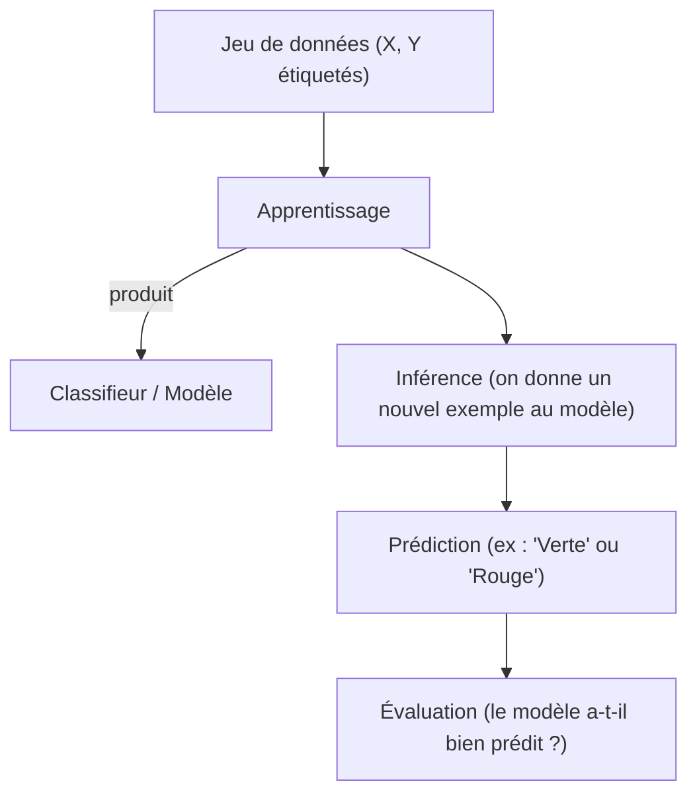

# 
Le Machine Learning en pratique — Cours expliqué

*Basé sur le cours de Vincent Guigue & Romain Thoreau (AgroParisTech / INRAE / Université Paris-Saclay), avec tes notes intégrées et complétées.*
---

## 1. Introduction : les différents cadres du Machine Learning

Avant de rentrer dans les modèles, il faut comprendre quel type de problème on essaie de résoudre. C'est la première question à se poser, car elle détermine tout le reste (type de données nécessaires, type de modèle, façon d'évaluer).

### 1.1 Les 4 (+1) grandes familles

Imagine que tu as un tas de points de données, chacun pouvant appartenir à une catégorie (rond noir ou rond blanc) :

- Supervisé : tu connais déjà l'étiquette (la classe) d'une partie de tes données (les ronds noirs = classe connue), et tu veux apprendre une règle pour prédire l'étiquette des points inconnus (les "?"). C'est comme apprendre avec un professeur qui corrige tes réponses.
    *Exemple* : à partir de photos de pommes déjà étiquetées "verte"/"rouge", apprendre à classer une nouvelle pomme.

- Non-supervisé : tu n'as aucune étiquette. Tu cherches juste à découvrir une structure cachée dans les données (des groupes naturels, des zones de densité...).
    *Exemple* : regrouper des clients par comportement d'achat sans savoir à l'avance quels groupes existent.

- Semi-supervisé : un entre-deux — tu as quelques étiquettes (peu coûteuses à obtenir) et beaucoup de données non étiquetées. Le modèle essaie de tirer parti des deux.

- Par renforcement : il n'y a pas d'étiquette "correcte" donnée à l'avance. Un agent agit dans un environnement, reçoit une récompense (positive ou négative), et apprend petit à petit la stratégie qui maximise cette récompense sur le long terme.
    *Exemple* : un robot qui apprend à marcher, une IA qui apprend à jouer aux échecs.

- Generative AI (ajouté dans la version récente du cours) : le but n'est plus de prédire une étiquette Y à partir de X, mais de générer un nouveau contenu Y (texte, image...) cohérent avec un contexte X. C'est une extension du cadre supervisé où la sortie est complexe et structurée (pas juste une classe).

Pourquoi cette distinction compte : chaque cadre a ses propres algorithmes, ses propres façons d'évaluer la performance, et surtout des coûts différents pour obtenir les données (étiqueter des données à la main coûte cher — d'où l'idée d'utiliser des plateformes comme Amazon Mechanical Turk pour payer des humains à annoter des données en masse).

### 1.2 Les grandes familles de problématiques supervisées

Une fois qu'on est en supervisé, il reste à savoir quel type de sortie on veut prédire :
| Problème | Ce qu'on prédit | Exemple |
| :--- | :--- | :--- |
| **Classification** | Une catégorie parmi un nombre fini (ex : content/triste, verte/rouge) | Un mail est-il un spam ? |
| **Régression** | Une valeur continue (un nombre réel) | Prédire le prix d'une maison, une température |
| **Ranking** | Un ordre entre plusieurs éléments | Trier des résultats de recherche par pertinence |
| **Generative AI** | Une sortie complexe et structurée (texte, image) | Générer une réponse à une question |

En régression, on distingue aussi :
- l'interpolation : prédire une valeur entre deux points déjà connus (on est "en sécurité", entouré de données).
- le forecasting (prévision) : prédire une valeur au-delà des données connues (on extrapole — c'est plus risqué, car le modèle n'a jamais rien vu dans cette zone).

Point clé du cours : il existe très peu de problématiques génériques (4-5 grandes familles), mais un nombre presque infini d'applications concrètes. Comprendre la problématique sous-jacente permet de réutiliser les mêmes outils dans des contextes très différents.

### 1.3 La chaîne de traitement complète

Le cours présente un schéma simple mais fondamental, qu'il faut avoir en tête pour tout projet de ML :

En version concrète, il y a une étape cruciale avant l'apprentissage : l'extraction de caractéristiques (feature extraction). On ne donne jamais une image brute ou un objet brut à un modèle classique — on transforme d'abord l'objet en un vecteur de nombres qui décrit ses propriétés utiles (diamètre, texture, niveau de rouge, niveau de bleu, etc. pour une pomme).

Mathématiquement, un modèle linéaire simple s'écrit :

$$f(\mathbf{x}) = \sum_j \alpha_j x_j$$

C'est-à-dire : on pondère chaque caractéristique $x_j$ par un coefficient $\alpha_j$ (appris automatiquement) et on somme. Le signe du résultat (positif/négatif) donne la classe prédite.

Deux leviers pour améliorer un modèle :  
- Sélectionner les bonnes colonnes (les caractéristiques réellement utiles, enlever le bruit)  
- Ajouter des colonnes intéressantes (calculs dérivés, données externes)

### 1.4 Pourquoi l'évaluation est aussi importante que le modèle

C'est un point insisté très fortement dans le cours, à raison :

> **Modèle sans mesure de performance = pas de sens**. 
> **Modèle + performance fausse = danger** (on peut déployer un mauvais modèle en pensant qu'il est bon → conséquences réelles). 
> **Modèle + performance basse = difficile à vendre** (mais au moins on sait où on en est, et on peut chercher à faire un "modèle v2").

L'idée : un modèle n'a de valeur que si on peut mesurer objectivement sa qualité, et cette mesure doit être honnête (pas biaisée). On y reviendra en détail dans la partie Évaluation.

---

## 2. Les grandes classes de modèles : panorama historique

Le cours fait un tour d'horizon chronologique des grandes familles de modèles. L'idée n'est pas de tout maîtriser en détail à ce stade, mais de savoir quand et pourquoi utiliser chaque famille.

### 2.1 Les références historiques

- Arbres de décision : à mi-chemin entre l'IA symbolique (des règles écrites par des humains, "si... alors...") et l'apprentissage statistique (les règles sont apprises automatiquement à partir des données).  
  Avantage : très interprétable, on peut littéralement lire les règles de décision.
- Modélisation bayésienne (Naive Bayes) : on modélise chaque classe par une loi de probabilité (souvent une gaussienne), et on classe un nouveau point selon la classe dont la probabilité est la plus forte. Le "Naive" (naïf) vient du fait qu'on suppose que toutes les caractéristiques sont indépendantes entre elles — une hypothèse fausse en général, mais qui marche étonnamment bien en pratique et qui est très rapide à calculer.

### 2.2 Les "bonnes affaires" : modèles linéaires et discriminants

- Modèles linéaires (moindres carrés, régression logistique) : une fonction simple qui trace une frontière (ou une droite/hyperplan) entre les classes, ou qui ajuste une droite aux données en régression. 
  Simple, rapide, et souvent étonnamment efficace — d'où le conseil du cours : toujours comparer un modèle complexe à un modèle linéaire (rasoir d'Ockham : si le modèle linéaire fait aussi bien, pas la peine de complexifier inutilement).

- SVM (Support Vector Machines) et méthodes à noyaux : on cherche l'hyperplan séparateur qui maximise la marge entre les classes (la distance entre la frontière et les points les plus proches de chaque classe). On y reviendra en détail en section 4.

### 2.3 Les approches non-supervisées

- Estimation de densité (Parzen, Nadaraya-Watson, kNN, EM) : estimer où les données sont denses dans l'espace, sans notion de classe.
- Clustering (k-means, clustering hiérarchique, clustering spectral) : regrouper automatiquement les points en groupes ("clusters") qui se ressemblent, sans savoir à l'avance combien de groupes il y a ni ce qu'ils représentent.

### 2.4 L'état de l'art 

- Approches ensemblistes (Bagging, Boosting, Random Forest, XGBoost) : au lieu d'apprendre un seul modèle, on en apprend plusieurs et on combine leurs prédictions. L'idée : plusieurs modèles "moyens" combinés intelligemment battent souvent un seul modèle complexe. Détaillé en section 3.

- Réseaux de neurones (perceptron, rétropropagation du gradient, deep learning avec PyTorch) : des modèles composés de couches de neurones connectées, capables d'apprendre des représentations très complexes (ex : reconnaître des chiffres manuscrits MNIST). Ce n'est pas le focus de ce premier cours, mais c'est la porte d'entrée vers le deep learning.

---

## 3. Focus sur les arbres de décision
### 3.1 Notations de base en classification

Avant de plonger dans les arbres, il faut connaître le vocabulaire standard :

- **$\mathcal{X}$** : L'espace de représentation (souvent $\mathbb{R}^d$, un espace à $d$ dimensions)
- **$X_j$** : Une caractéristique / variable (une colonne du tableau de données)
- **$\mathbf{x}_i = (x_{i1}, \dots, x_{id})$** : Un exemple / instance (une ligne du tableau, avec $d$ caractéristiques)
- **$Y = \{y_1, \dots, y_n\}$** : Les étiquettes de supervision (dans le cas binaire, $y_i \in \{0,1\}$ ou $\{-1,1\}$)  
L'objectif général du ML supervisé se résume en une phrase : trouver une fonction $f : \mathcal{X} \rightarrow Y$ qui prédit correctement l'étiquette de futurs exemples (pas seulement ceux déjà vus).

### 3.2 Le principe de l'arbre de décision

Imagine un arbre organisationnel : on part de la racine, et à chaque nœud, on teste une variable (ex : "X2 ≤ 6.0 ?"). Selon la réponse, on descend vers une branche différente. On répète jusqu'à arriver à une feuille, qui donne la classe prédite.

    Nœud = test d'une variable
    Branche = résultat du test (oui/non, ou une plage de valeurs)
    Feuille = étiquette finale prédite

C'est essentiellement une succession de règles "si... alors...", mais ces règles sont découvertes automatiquement à partir des données, pas écrites à la main.

### 3.3 L'algorithme de construction (glouton, top-down)

L'arbre se construit de façon gloutonne (greedy) — à chaque étape, on prend la décision qui semble la meilleure localement, sans se soucier de ce qui se passera plus tard (pas d'optimisation globale) :

On part de la racine avec tous les exemples.  
Si le nœud n'est pas "pur" (mélange de plusieurs classes) :  
    - On cherche la meilleure variable $X_j$ pour séparer les exemples à ce nœud, et le seuil de test associé.  
    - On crée un fils par résultat de test possible.  
    - On répartit les exemples du nœud courant vers leurs fils correspondants.  
Sinon (le nœud est pur, ou presque), on le transforme en feuille.

Sur l'exemple du cours : on coupe d'abord sur X2 ≤ 6.0 (ça isole bien la classe 1 tout en haut), puis sur la partie restante on coupe sur X1 ≤ 3.0. Résultat : un arbre à 2 niveaux qui sépare bien les deux classes.

### 3.4 Comment choisir la "meilleure" variable ? L'entropie

C'est le cœur mathématique des arbres de décision. L'idée : on veut choisir le test qui réduit le plus le désordre (le mélange de classes) dans les sous-groupes créés.

Entropie d'une variable aléatoire :

$$H(X) = -\sum_{i=1}^n P(X=x_i) \log(P(X=x_i))$$

Intuition : l'entropie mesure à quel point le résultat est imprévisible.

    Si toutes les données d'un nœud sont de la même classe → entropie nulle → aucun désordre, aucun hasard → classification parfaite.
    Si les classes sont mélangées 50/50 → entropie maximale (elle atteint son pic à $Pr(X=1) = 0.5$ sur le graphe du cours) → désordre maximal, on ne sait pas quoi prédire.

Entropie conditionnelle : une fois qu'on applique un test $T$, on obtient deux sous-groupes $X^{(1)}$ et $X^{(2)}$ (respecte le test / ne le respecte pas). L'entropie conditionnelle est la moyenne pondérée de l'entropie dans chaque sous-groupe :

$$H(Y|T) = \frac{|X^{(1)}|}{|X|}H(Y^{(1)}) + \frac{|X^{(2)}|}{|X|}H(Y^{(2)})$$

Gain d'information :

$$I(T,Y) = H(Y) - H(Y|T)$$

On choisit le test $T$ qui maximise le gain d'information, ce qui revient à minimiser l'entropie conditionnelle $H(Y|T)$ — c'est-à-dire le test qui "nettoie" le plus les sous-groupes.

### 3.5 Cas discret vs cas continu

    Variable discrète (ex : $X_j \in {A, B, C}$) : le calcul est direct, on divise simplement les exemples en 3 groupes selon leur valeur, et on calcule l'entropie de chaque groupe.

    Variable continue (ex : $X_j \in [0, 2]$) : il n'y a pas de catégories naturelles ! Il faut donc tester tous les seuils de coupure possibles :
        Trier les valeurs de $X_j$
        Calculer $H(Y|X_j)$ pour chaque seuil candidat (typiquement entre chaque paire de valeurs consécutives)
        Garder le seuil qui donne l'entropie la plus basse

Le cours montre une "courbe type" entropie vs seuil de coupure : elle descend, atteint un minimum (le meilleur seuil), puis remonte — on choisit le point le plus bas.

### 3.6 Pourquoi les arbres restent importants aujourd'hui

Ta note dit très justement : "plus personne n'utilise les arbres de décision seuls en pratique (à part en tuto), mais c'est très lisible." Le cours confirme : c'est une approche ancienne (C4.5, systèmes experts), mais elle reste la brique de base des méthodes ensemblistes les plus utilisées aujourd'hui :

    Random Forest : on construit plusieurs arbres, chacun sur un sous-ensemble aléatoire des exemples ET un sous-ensemble aléatoire des variables (d'où le "random"). Chaque arbre vote pour une classe, et la classe la plus votée gagne. Le fait de varier aléatoirement les variables utilisées par chaque arbre les rend plus différents les uns des autres, ce qui améliore la robustesse de l'ensemble (moins de sur-apprentissage).

    Gradient Boosting (XGBoost, CatBoost) : basé sur le même principe d'ensemble d'arbres, mais avec un twist : au lieu de construire les arbres indépendamment, on les construit séquentiellement, chaque nouvel arbre essayant de corriger les erreurs du précédent. Concrètement, on tire un échantillon biaisé vers les points sur lesquels le modèle actuel se trompe le plus, pour forcer le nouvel arbre à se concentrer dessus.

Rappel méthodologique important (ta note) : toujours comparer ces modèles complexes à un modèle linéaire simple. Si les performances sont équivalentes, le rasoir d'Ockham dit de préférer le modèle le plus simple (plus interprétable, plus rapide, moins de risque de sur-apprentissage).

## 4. Focus sur les SVM (Support Vector Machines)
### 4.1 La modélisation générique d'un problème de ML

Avant de rentrer dans le SVM en particulier, le cours pose le cadre général de tout problème d'apprentissage supervisé — c'est une grille de lecture à retenir pour n'importe quel modèle :

    Identifier la cible $Y$ : qu'est-ce qu'on veut prédire ? (rendement agricole, diagnostic médical, détection d'anomalie...)
    Identifier les variables descriptives $X$
    Choisir une modélisation : une fonction (linéaire ou non) qui relie $X$ à $Y$, par exemple $f(\mathbf{x}) = \sum_j x_j w_j$
    Choisir une fonction de coût (aussi appelée loss) : elle mesure à quel point les prédictions du modèle sont "mauvaises". Ex, moindres carrés : $$\mathcal{L} = \sum_i (f(\mathbf{x}_i) - y_i)^2$$
    Optimiser le coût : trouver les paramètres $\mathbf{w}^\star$ qui minimisent $\mathcal{L}$ (typiquement par descente de gradient).

Le piège à éviter : le risque empirique (l'erreur mesurée sur les données d'apprentissage) n'est pas le même que le risque en généralisation (l'erreur sur de nouvelles données jamais vues). D'où la nécessité absolue d'une évaluation robuste (section 5).
4.2 Le SVM en détail

Le SVM est un classifieur binaire ($y_i \in {-1, 1}$) qui se distingue par deux choix précis :

a) La fonction de coût (charnière / hinge loss) :

$$\mathcal{L} = \sum_{i=1}^n (1 - y_i f(\mathbf{x}i))+ \quad \text{où} \quad (a)_+ = \max(a, 0)$$

La partie positive $(a)_+$ signifie : "si $a$ est négatif, le coût est nul ; sinon, le coût est $a$". Concrètement, cela veut dire :

    Si un point est bien classé et suffisamment loin de la frontière (marge respectée), le coût est nul — pas de pénalité.
    Si un point est mal classé, ou bien classé mais trop proche de la frontière, il y a une pénalité proportionnelle à l'erreur.

C'est différent des moindres carrés (utilisés en régression) : les moindres carrés pénalisent tout écart, même minime, alors que la hinge loss du SVM "laisse tranquilles" les points déjà bien classés avec une marge confortable. Ça concentre l'effort d'apprentissage sur les points difficiles, proches de la frontière.

b) La forme duale et la notion de noyau (kernel)

$$f(\mathbf{x}i) = \sum{j=1}^{n_{app}} w_j \cdot k(\mathbf{x}_i, \mathbf{x}_j)$$

Au lieu d'exprimer $f$ directement en fonction des variables $x_j$, on l'exprime en fonction de la similarité entre le point à prédire et chacun des points d'apprentissage, via une fonction noyau $k$. C'est ce qu'on appelle la forme "duale" : la décision repose sur des comparaisons entre points d'apprentissage, pas sur une formule linéaire directe.

Point insisté par le cours (et ta note !) : le choix du noyau (gaussien, linéaire, polynomial...) est une décision humaine, pas quelque chose que la machine choisit toute seule. C'est un des réglages les plus importants du SVM.

c) La régularisation

$$\mathcal{L} = \sum_{i=1}^n (1 - y_i f(\mathbf{x}i))+ + C|\mathbf{w}|^2$$

On ajoute un terme qui pénalise les poids $\mathbf{w}$ trop grands. L'hyperparamètre $C$ contrôle l'équilibre :

    $C$ grand : on privilégie fortement le fait de bien classer tous les points d'apprentissage, quitte à avoir une frontière très complexe (risque de sur-apprentissage).
    $C$ petit : on privilégie une frontière simple et une grande marge, quitte à tolérer quelques erreurs de classification sur l'apprentissage (souvent meilleur en généralisation).

4.3 Les vecteurs de support et la marge

Fait remarquable et très intuitif visuellement dans le cours : dans le cas linéaire, la frontière de décision pour tout l'espace ne dépend en réalité que d'un petit nombre de points — ceux situés sur ou dans la marge (la zone où le coût n'est pas nul). Ce sont les vecteurs de support.

Tous les autres points d'apprentissage, même s'ils ont servi à l'entraînement, n'ont aucune influence sur la position finale de la frontière. C'est une propriété très élégante : le modèle final est "sparse" (ne dépend que de quelques exemples), ce qui le rend efficace en mémoire.

    Les points loin de la frontière, bien classés → coût nul → pas de vecteur support.
    Les points sur la marge ou mal classés → coût non nul → deviennent vecteurs supports.

4.4 Le lien avec les mixtures de gaussiennes (noyau gaussien)

Avec un noyau gaussien (RBF) :

$$k(\mathbf{x}_i, \mathbf{x}_j) = \exp\left(-\frac{|\mathbf{x}_i - \mathbf{x}_j|^2}{2\sigma^2}\right)$$

chaque vecteur support "diffuse" une bosse gaussienne autour de lui, et la frontière de décision devient la somme pondérée de toutes ces bosses. C'est ce qui permet au SVM de tracer des frontières non linéaires, très flexibles (voir les 3 exemples du cours : SVC linéaire → droite ; SVC gaussien → courbe souple ; SVC gaussien avec un $\sigma$ plus petit → frontière très découpée, presque une bulle autour de chaque point).

Attention au sur-apprentissage : un noyau gaussien avec un $\sigma$ trop petit colle trop aux données d'apprentissage (chaque point devient presque sa propre bulle) — le modèle ne généralisera pas bien.
4.5 Du binaire au multi-classes : "un contre tous"

Le SVM (comme la régression logistique) est nativement binaire. Pour gérer $K$ classes, la stratégie la plus courante est un-contre-tous (one-vs-rest) :

    On entraîne $K$ classifieurs binaires indépendants, chacun sur toutes les données :
        Classifieur 1 : classe verte (positif) vs. tout le reste (négatif)
        Classifieur 2 : classe bleue (positif) vs. tout le reste (négatif)
        Classifieur 3 : classe rouge (positif) vs. tout le reste (négatif)
    Pour un nouveau point, on applique les $K$ classifieurs et on regarde qui répond "positif" :

$$k^\star = \arg\max_k f_k(\mathbf{x})$$

Les cas ambigus (ta note les résume bien) :

    Positif pour 1 seul classifieur, négatif pour les autres → cas idéal, décision claire.
    Négatif pour tous → "rejet en distance" (le point est trop loin de toutes les classes connues). En pratique, on prend quand même la classe avec le score le plus élevé (imparfait mais ça donne un résultat exploitable), ou on rejette la décision et on la transmet à un expert humain.
    Positif pour 2 ou plus → "rejet en ambiguïté" entre plusieurs classes. Solution possible : fixer des seuils de décision plus stricts, mais c'est délicat à régler.

4.6 Conclusions sur le SVM

    Ça a été la méthode de référence dans les années 90-2000.
    Il existe de nombreux noyaux adaptés à différents types de données (graphes, images...).
    À l'origine conçu pour la classification (SVM/SVC), il existe des extensions pour la régression (SVR).
    Limite majeure : problème de passage à l'échelle. La complexité de calcul est au mieux en $O(n^2)$, souvent $O(n^3)$ ou $O(n^4)$ selon l'implémentation — ce qui le rend impraticable sur de très grands jeux de données (c'est une des raisons pour lesquelles le deep learning et les méthodes ensemblistes (Random Forest, XGBoost) ont pris le dessus sur de gros volumes de données).

5. Évaluation et sélection de modèle
5.1 Pourquoi ne jamais évaluer sur les données d'apprentissage

Règle absolue : évaluer un modèle sur les données qui ont servi à l'entraîner (à régler ses paramètres), c'est tricher. Le modèle a "vu" ces données, il est optimisé pour bien les prédire — la performance mesurée sera artificiellement gonflée (surestimation).

La bonne pratique : on découpe les données en deux parties disjointes dès le départ :

    Apprentissage (train) : sert à entraîner le modèle.
    Test : des données "vierges", jamais vues par le modèle pendant l'entraînement, servent uniquement à évaluer.

5.2 Ta note sur les précautions de découpage — bien vu, à détailler

Ton résumé est juste, voici les explications derrière chaque point :

    Bien mélanger les catégories : si les données sont triées par classe (ex : toutes les pommes vertes d'abord, puis toutes les rouges), un découpage naïf (ex : 80% premiers exemples en train, 20% derniers en test) pourrait mettre uniquement des pommes rouges dans le test. Il faut donc mélanger (shuffle) avant de découper.

    Biais de représentativité : si une classe est rare (ex : 5% de fraudes), il faut s'assurer de garder la même proportion de chaque classe entre apprentissage et test (on parle de découpage stratifié). Sinon on pourrait se retrouver avec un jeu de test qui ne contient quasiment aucun exemple de la classe rare — évaluation peu fiable.

    Jeu de données trop petit → validation croisée : si on n'a pas beaucoup de données, on est face à un dilemme : mettre beaucoup en apprentissage (bon modèle, mais test peu fiable car trop petit) ou l'inverse (test fiable, mais modèle mal entraîné). La solution : la validation croisée (cross-validation).

    Principe : on découpe les données en $K$ parties ("folds"). À chaque itération, on utilise $K-1$ parties pour l'apprentissage et 1 partie pour le test — et on change la partie de test à chaque itération. On obtient ainsi $K$ modèles et $K$ mesures de performance, qu'on moyenne pour avoir une estimation plus robuste. Coût : il faut entraîner $K$ modèles au lieu d'un seul — attention au coût de calcul si $K$ est grand ou si le modèle est lent à entraîner.

    Cas extrême : Leave-One-Out (LOO) — on laisse un seul point de côté à chaque itération (donc $K = n$, le nombre total de points). On obtient une estimation très précise, mais avec un coût de calcul énorme (il faut entraîner $n$ modèles !). Utilisé surtout quand on a très peu de données.

    Les fuites de données (data leakage) : c'est un piège fréquent et dangereux. Cela arrive quand une information qui ne devrait être disponible qu'à l'entraînement se retrouve — directement ou indirectement — aussi dans le test (ou pire, dans les caractéristiques elles-mêmes). Résultat : le modèle "triche" sans qu'on s'en rende compte, et le score est surestimé.

    Exemple classique : normaliser (centrer-réduire) toutes les données avant de les découper en train/test — la moyenne et l'écart-type calculés incluent alors des informations du jeu de test, ce qui est une fuite subtile.

5.3 Les cas déséquilibrés (aperçu, développé au prochain cours)

Quand une classe est très minoritaire (anomalies, fraudes, entités rares dans du texte), le simple taux de bonne classification (accuracy) devient trompeur. Un modèle qui prédit toujours "pas de fraude" aura 99% de bonnes réponses si les fraudes représentent 1% des cas — tout en étant complètement inutile !

Cela nécessite des métriques adaptées (précision, rappel, F1-score, AUC...) et des procédures d'évaluation spécifiques — sujet du cours suivant.
6. Conclusion : scikit-learn

Le cours se termine sur scikit-learn, la bibliothèque Python de référence pour le ML "classique" (hors deep learning). Ce qui la rend si puissante :

    Des modèles "sur l'étagère" : supervisé, non-supervisé, estimation de densité... tous avec une interface commune.
    Des outils complets : métriques, pré-traitements (normalisation, encodage...), pipelines pour enchaîner les étapes.
    Parallélisation des calculs via le paramètre n_jobs.
    Extensible : on peut y insérer ses propres modèles dans ce cadre standardisé.

La syntaxe de base à retenir

from sklearn import svm, linear_model, naive_bayes

# création d'un modèle bayésien naïf
mod = naive_bayes.GaussianNB()

# apprentissage sur les données d'apprentissage
mod.fit(Xapp, Yapp)

# inférence sur un jeu de test complet
yhat = mod.predict(Xtest)          # tableau de dimension (n_test,)

# inférence sur un seul exemple : attention à la syntaxe !
yhat = mod.predict([Xtest[0]])     # il faut une LISTE de listes, même pour 1 seul point
                                    # car predict() attend toujours une matrice 2D (n_exemples, n_variables)

# probabilités plutôt qu'une classe unique
yhat = mod.predict_proba(Xtest)    # dimension (n_test, n_classes) : une proba par classe

Ce qui a une syntaxe quasi-identique quel que soit le modèle (arbre, SVM, régression logistique...) : mod = Modele(...), mod.fit(X, Y), mod.predict(X). C'est précisément ce qui rend scikit-learn si agréable à utiliser : une fois qu'on maîtrise ce squelette, on peut tester n'importe quel modèle en changeant une seule ligne.

Les questions ouvertes de la fin de cours (à explorer en TP) :

    Comment calculer un taux de bonne classification à partir de yhat et Ytest ?
    Comment "inspecter" un modèle après apprentissage (quels poids, quelles règles) ?
    Comment passer d'un modèle bayésien naïf à un arbre de décision dans ce même cadre (sklearn.tree.DecisionTreeClassifier) ?
